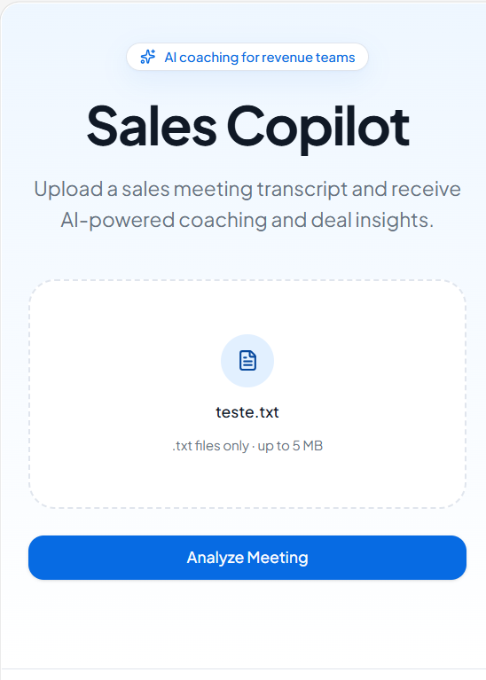

# Sales Copilot

Projeto desenvolvido como parte do processo seletivo da ZapSign.

O objetivo foi criar uma aplicação capaz de analisar transcrições de reuniões comerciais utilizando Inteligência Artificial, gerando insights para apoiar vendedores durante o processo de vendas.

---

## Objetivo

Receber uma transcrição (.txt) de uma reunião comercial e gerar automaticamente:

- Resumo executivo
- Score de oportunidade
- Análise SPIN Selling
- Principais insights do cliente
- Próximos passos sugeridos

A ideia é transformar uma conversa comercial em informações práticas para apoiar o vendedor na condução da oportunidade.

---

## Demo

Você pode acessar a aplicação publicada no Lovable através do link abaixo:

**Aplicação:**  
https://sales-coach-ai-17.lovable.app

**Repositório:**  
https://github.com/olleticia/sales-copilot

> **Observação:** para testar a aplicação, faça upload de um arquivo `.txt`
contendo a transcrição de uma reunião comercial. O sistema irá gerar
automaticamente um resumo executivo, Opportunity Score, análise SPIN,
insights do cliente e recomendações de follow-up.

---

## Como funciona

Fluxo da aplicação:

Transcrição (.txt)

↓

Interface construída no Lovable

↓

Webhook (n8n)

↓

OpenAI

↓

Retorno estruturado em JSON

↓

Dashboard com os insights da reunião

---

## Ferramentas utilizadas

- Lovable
- n8n
- OpenAI API

---

## Como testar

1. Abrir a aplicação.
2. Fazer upload de um arquivo `.txt`.
3. Clicar em **Analyze Meeting**.
4. Visualizar os insights gerados automaticamente.

---

## O que aprendi

Este foi meu primeiro contato com ferramentas como Lovable, n8n e integração com APIs.

Durante o desenvolvimento precisei aprender a:

- conectar serviços por webhook;
- interpretar respostas em JSON;
- corrigir problemas de integração;
- adaptar a interface para consumir corretamente os dados retornados pela IA.

Foi um desafio bastante diferente da minha experiência em vendas, mas extremamente enriquecedor.

---

## Screenshots

*(vamos colocar aqui algumas imagens da aplicação)*

---

## Link da aplicação

https://SEU-LINK.lovable.app
---

# 📸 Screenshots

### Home

Tela inicial da aplicação.

---

### Executive Summary e Opportunity Score

Resultado da análise da reunião.

---

### Customer Insights e SPIN Assessment

Insights gerados automaticamente pela IA.

---

### Continuação da avaliação SPIN

Detalhamento da análise das perguntas realizadas durante a reunião.

---

### Follow-up Recommendations

Sugestões práticas de próximos passos para aumentar as chances de fechamento.

